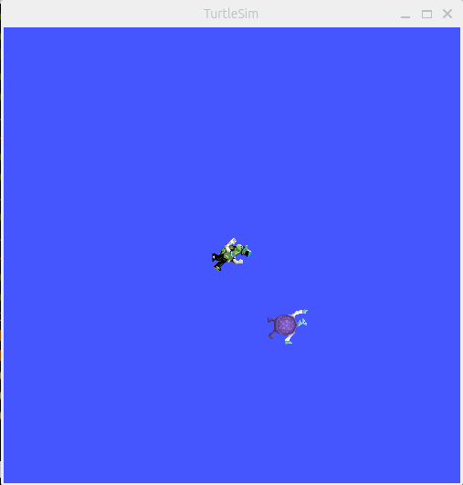

# turtle_scanner_josue
## Installation

### 1. Créer le workspace ROS

```sh
mkdir -p ~/turtle_ws/src
cd ~/turtle_ws
colcon build
```

### 2. Cloner les dépôts

```sh
cd src
git clone git@github.com:njaraT/turtle_scanner_josue.git
```

### 3. Build & source

```sh
cd ..
colcon build
source install/setup.bash
```

## Partie 1

### Build

```bash
cd ~/ros2_ws
colcon build --packages-select turtle_scanner_josue
source install/setup.bash
```

### Lancement

Terminal 1 :

```bash
ros2 run turtlesim turtlesim_node
```

Terminal 2 :

```bash
source ~/ros2_ws/install/setup.bash
ros2 run turtle_scanner_josue spawn_target_node
```

### Resultat attendu

Une deuxieme tortue apparait dans TurtleSim avec le nom `turtle_target`, et le noeud affiche un
message contenant ses coordonnees.

## Screenshot


## Partie 2

### Lancement

Terminal 1 :

```bash
ros2 run turtlesim turtlesim_node
```

Terminal 2 :

```bash
source ~/ros2_ws/install/setup.bash
ros2 run turtle_scanner_josue spawn_target_node
```

Terminal 3 :

```bash
source ~/ros2_ws/install/setup.bash
ros2 run turtle_scanner_josue turtle_scanner_node
```

### Verification

```bash
ros2 topic echo /turtle1/pose
ros2 topic echo /turtle_target/pose
```

## Partie 3

### Lancement

```bash
ros2 run turtlesim turtlesim_node
ros2 run turtle_scanner_josue spawn_target_node
ros2 run turtle_scanner_josue turtle_scanner_node
```

### Noeud
`Kp_ang` Valeur trop faible = la tortue s'aligne lentement vers le waypoint et le changement de direction est mou
 Valeur trop forte = la tortue tourne trop brutalement et peut osciller autour de la direction desirée
valeur choisi = 6.0

`Kp_lin` Valeur trop faible = la tortue avance lentement et le balayage prend plus de temps 
Valeur trop forte =la tortue avance trop vite, peut depasser plus facilement la cible et rendre la trajectoire moins stable
valeur choisi = 1..2

### Resultat attendu

`turtle1` parcourt la fenetre TurtleSim en serpentin de bas en haut. Quand tous les waypoints sont
atteints, le noeud publie une vitesse nulle et affiche `Balayage termine`.